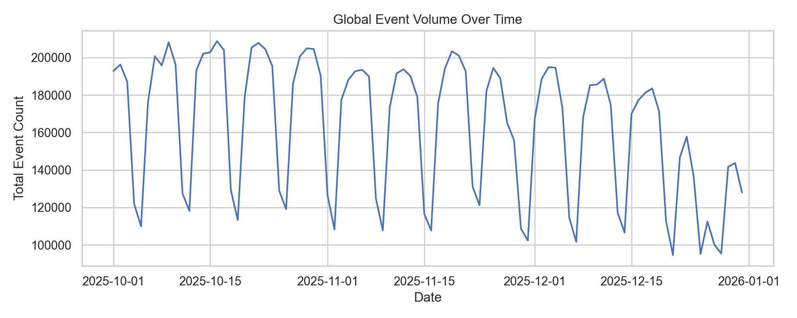
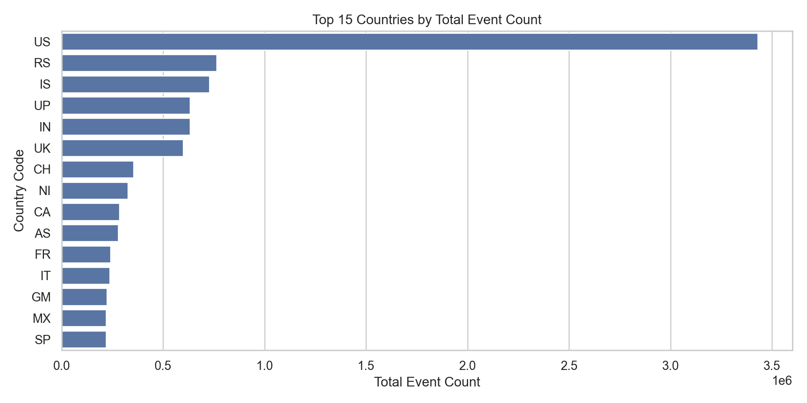
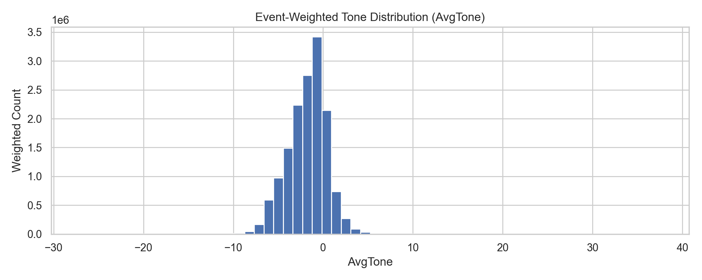
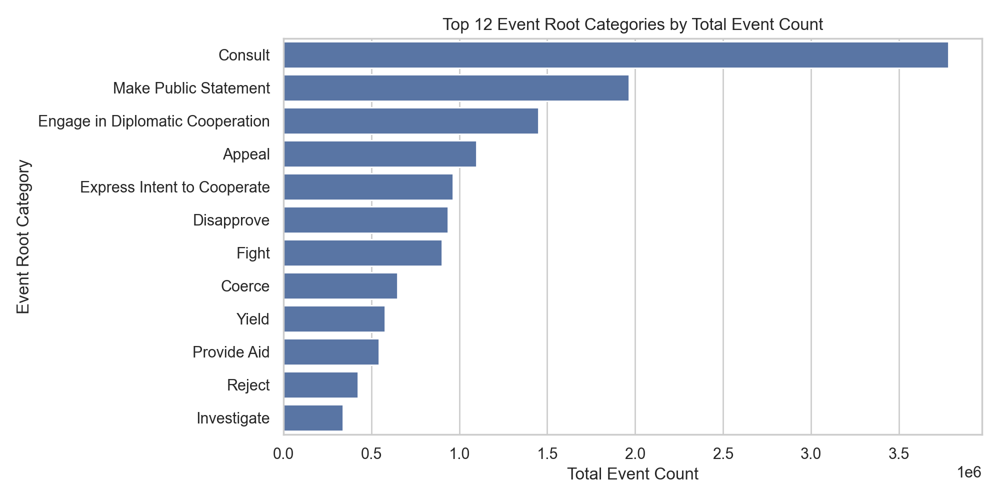
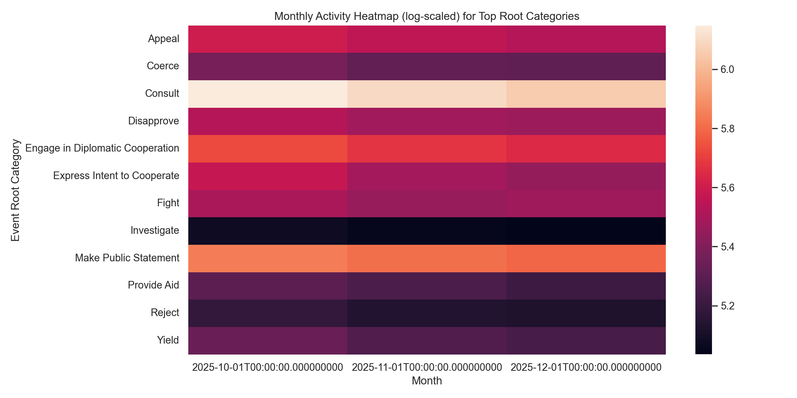
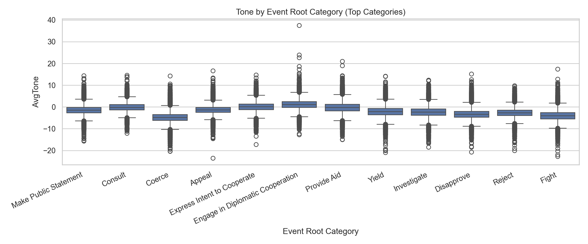
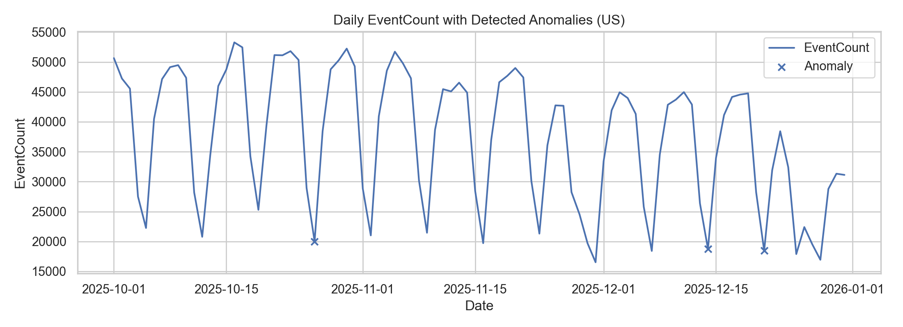
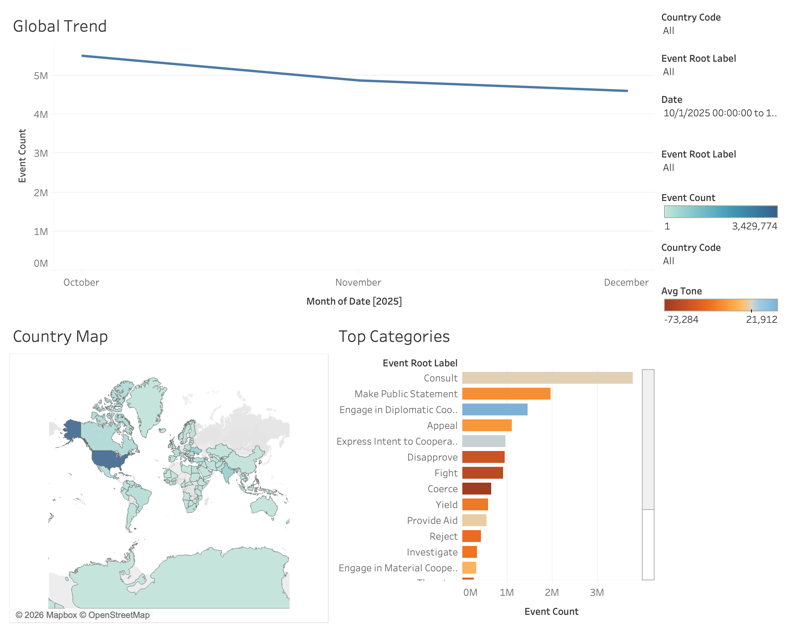

# Project 02 — GDELT News Intelligence (BigQuery + Python + Tableau)

## Goal
Build a large-scale, reproducible pipeline that pulls global news-derived event signals from GDELT in BigQuery, cleans and aggregates them, produces analysis + visualizations, and then publishes a Tableau dashboard.

## Data source
- BigQuery public project: `gdelt-bq`
- Dataset: `gdeltv2`
- Table used: `gdelt-bq.gdeltv2.events_partitioned`

This dataset is designed to be analyzed at scale in BigQuery rather than downloaded in full. Only aggregated extracts are pulled locally for modeling and visualization.

## Cost control rule
All BigQuery queries in this repo filter `_PARTITIONTIME` with constant timestamps so partition pruning works and query cost stays controlled.

## Repo structure
- `src/` scripts (extract, clean, visualize)
- `reports/figures/` saved PNG charts
- `reports/` markdown reports
- `data/extracts/` local BigQuery extracts (ignored by git)
- `data/processed/` cleaned outputs (ignored by git)


## Authentication (BigQuery)

- gcloud auth login
- gcloud auth application-default login
- gcloud config set project gen-lang-client-0366281238
- gcloud auth application-default set-quota-project gen-lang-client-0366281238
- gcloud services enable bigquery.googleapis.com

## Pipeline (run in order)
- python src/bq_smoke_test.py
- python src/extract_events_daily.py
- python src/clean_events_daily.py
- python src/viz_overview.py
- python src/detect_anomalies.py
- python src/publish_tableau_table.py

## Visualizations (auto-saved to `reports/figures/`)

### Global Event Volume Over Time


### Top 15 Countries by Total Event Count


### Event-Weighted Tone Distribution


### Top Event Root Categories


### Monthly Activity Heatmap (Top Categories)


### Tone by Event Root Category


## Anomaly detection (country-day)

The model flags unusual country-days using rolling z-score features and Isolation Forest.

### Example: anomalies for the highest-activity country in this window


### Ranked anomalies (top 50)
- CSV: `reports/anomalies/top_50_country_day_anomalies.csv`

## Workbook
- File: `gdelt_global_pulse.twb`
- BigQuery table: `gen-lang-client-0366281238.gdelt_portfolio.events_daily_clean`

## Refresh
Open the workbook and refresh the data source. If the table is overwritten by the pipeline, the schema stays stable and refresh works.

## Tableau dashboard


## Setup (macOS)
```bash
python3 -m venv .venv
source .venv/bin/activate
pip install -r requirements.txt
